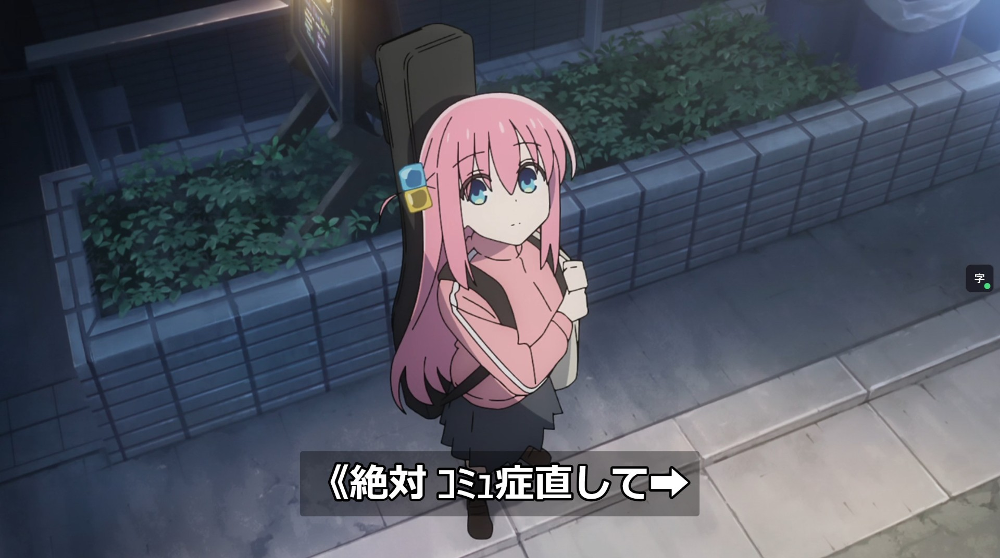

# Jimaku Player Revolutions

  

A userscript that adds a Japanese-subtitle layer to **any site using a supported video player** — [Vidstack](https://vidstack.io), [Video.js](https://videojs.com), [Plyr](https://plyr.io), or [JW Player](https://jwplayer.com). It browses [jimaku.cc](https://jimaku.cc), downloads `.srt` / `.ass` / `.vtt` files for the show you're watching, and renders them on top of the video — synced with one keypress.

Built for studying Japanese with anime.

## Install

1. Add a userscript manager like Tampermonkey or Violentmonkey:
   - **Chrome / Firefox / Edge:** [Tampermonkey](https://www.tampermonkey.net/) or [Violentmonkey](https://violentmonkey.github.io/)
   - **Safari:** [Userscripts](https://apps.apple.com/app/userscripts/id1463298887) (free, open-source)
2. Install the userscript from Github
   - **[Open directly in Tampermonkey / Violentmonkey](https://github.com/Inclushe/jimaku-player-revolutions/raw/refs/heads/main/jimaku-player-revolutions.user.js)**
   - Or open `jimaku-player-revolutions.user.js` above and click **Raw**
3. Open a website that uses a supported video player and click the **字** button.
4. Add your Jimaku API key (free) in Settings.
   1. Open <https://jimaku.cc> and create an account.
   2. Go to <https://jimaku.cc/account> and copy your API key.
   3. On any page with a supported player, hover the player → click the small **字** button at the top-right → **Settings** tab → paste the key → **Save**.

The script runs on every site (`@match *://*/*`) but stays completely idle until it detects a supported player (Vidstack, Video.js, Plyr, or JW Player) on the page, at which point the **字** button appears on the player. The Jimaku API is stored locally only, and is never sent anywhere except jimaku.cc itself.

## What it does

- Activates automatically whenever a supported player (Vidstack, Video.js, Plyr, or JW Player) is present on the page.
- **Auto-finds and loads the right subtitle file for the current episode** (on by default) — searches jimaku.cc on load and picks the best match by parsing each result's filename. Toggle in Settings.
  - Excludes Chinese subtitle files (`[CHS]` / `[CHT]`) by default.
  - Sticks to the release group you first used for a show, so later episodes match it automatically (shown under Browse).
- **Style controls** (Settings → Style): font size, outline thickness (scales with the font), background opacity, and font family (presets or your own). Plus **custom CSS** to restyle the overlay, panel, or the page's player.
- Pre-fills a search box from the page title (best-effort), or you type the show yourself.
- Searches [jimaku.cc](https://jimaku.cc) for matching Japanese subtitle files.
- Lists the files with WEB / BD / ASS tags so you can pick the one closest to your stream.
- Renders the subtitles directly over the video. Click a line to open it in [jisho.org](https://jisho.org).
- Sync them to the audio with a single keypress.
- Remembers your alignment per show + site, so episodes 2..N inherit it.

## Use

1. Open an episode on any site that uses a supported video player.
2. With **auto-load** on (the default), the script searches jimaku.cc and loads the best file for the detected episode automatically — you may not need to do anything. A toast confirms what was loaded.
3. To choose manually: hover the player (top right corner) → click **字** (or press **`J`**) → **Browse** tab. The search box is pre-filled from the page title when possible; otherwise type the show name and episode. Pick a file from the list (WEB-tagged ones tend to align best with streaming sources).
4. Subtitles appear at the bottom of the video.

Auto-load needs an API key and a detectable episode number; when it can't confidently match the show or episode, it stays out of the way and waits for you to pick. Manually loading a file always wins over auto-load for that episode.

### Sync in one keypress

If timing is off:

- The instant a line of dialogue is spoken, press **`S`**.
- The active (or next upcoming) subtitle is snapped to that moment. The whole file shifts with it.
- Press **`B`** to rewind to that subtitle and verify.
- If still slightly off, **`Z`** / **`X`** nudge by ±0.2s (hold **Shift** for ±1s).

That's the whole flow. Once a show is anchored, every subsequent episode loads with the same offset.

### Hotkeys

| Key | Action |
|-----|--------|
| `J` | Open / close the panel |
| `S` | Snap the current/upcoming subtitle to the video's current time |
| `B` | Rewind to the most recently-shown subtitle |
| `H` | Hide / show subtitles |
| `I` | Flip subtitles top / bottom |
| `Z` | Subtitles earlier (−0.2s, Shift = −1s) |
| `X` | Subtitles later (+0.2s, Shift = +1s) |

By default these keys are **consumed** so they don't also trigger the player's own shortcuts (only these keys; everything else passes through). Toggle it in Settings. Settings also has a **Reset options to defaults** button (which keeps your API key and per-show sync).

### Click a line

Clicking a rendered subtitle opens [jisho.org](https://jisho.org) for that text. Useful for looking up unknown words mid-episode.

## Limitations

- **Burned-in subtitles can't be removed.** If a site ships hard-subbed video, those stay. The script can hide the player's own caption track (Settings → it disables the player's native captions), or you can move our subtitles to the top (Settings → Position).
- **ASS positioning / styling is partially supported;** complex karaoke effects render plainly. Lines that overlap in time (including `.ass` lines sharing a start timestamp) are stacked and shown together.
- **Auto-detection is best-effort.** The show name is guessed from the page title (`og:title` / `<h1>` / `<title>` / the player's `title` attribute), so on many sites you'll need to type the show + episode into the search box yourself.
- **Provider must expose a `<video>` element.** HTML / HLS / DASH providers work; YouTube / Vimeo iframe providers don't expose a readable `<video>`, so time-sync won't work there.
- **Players inside iframes are supported** (detection + panel run in the top page; the overlay/controls run in the player iframe), **except fully sandboxed iframes** (`<iframe sandbox>` without `allow-scripts`) where no script can run. While the iframe player is in its own fullscreen, the panel — which lives in the top page — isn't visible; the subtitles and **字** button stay on the video.
- **jimaku.cc rate limit:** 25 requests / minute per key. Plenty for normal use; if you hammer the search box you'll get throttled briefly.

## Development

The userscript is a single self-contained file at `jimaku-player-revolutions.user.js`. No build step. Edit it, save, refresh.

It runs on every page (`@match *://*/*`) but does nothing until a supported player is found. Players are described by a small **adapter table** (`PLAYER_ADAPTERS`) near the top of the file — each entry lists the player's root selector(s) and its native-caption selectors (plus, for reference, the selector that marks its controls visible). `findPlayer()` returns the first matching player in priority order (Vidstack → Video.js → Plyr → JW Player); adding a player is just one more table entry. A single `watch()` loop — driven by a `MutationObserver`, history events (`popstate`/`hashchange`), and a 1s heartbeat — handles late-loading players and SPA sites that swap the player or change the URL between episodes without a reload. When a player appears (or a new episode is detected), it:

- Mounts the UI (overlay, **字** button, panel) inside the matched player's root element.
- Polls the underlying `<video>` element for the current time and to seek — this is the most reliable, sandbox-safe time source across players.
- Hides the player's native captions (when enabled) by disabling the `<video>`'s text tracks and CSS-hiding each adapter's caption elements (e.g. `media-captions`, `.vjs-text-track-display`, `.plyr__captions`, `.jw-captions`).
- Shows the **字** button on mouse activity over the player and hides it once the pointer goes idle (mirroring the player's own controls, but on its own timer — the per-player "controls visible" class is unreliable, especially in iframe embeds).
- Talks to the jimaku.cc API via `GM_xmlhttpRequest`.

State is stored with the manager's shared storage (`GM_setValue`/`GM_getValue`, `jp:*` keys) so the API key and settings carry across **every** site; where GM storage isn't available (e.g. Userscripts on Safari) it falls back to per-site `localStorage`, and any existing `localStorage` values are migrated up on first read. Per-show data (alignment, chosen entry) is keyed on `hostname + show title`.

The panel renders inside a **shadow root** (a `<body>`-level host with `:host { all: initial }`), so page stylesheets can't reach in and clash with it; user custom CSS is mirrored into the shadow so rules targeting `#jp-panel` still apply. Hotkeys are captured on `window` (capture phase) and the matching keydown/keyup/keypress are swallowed in the player's frame so players like JW Player can't act on the same key.

### Debugging

Some sites stop rendering when devtools is open. Add `?debug_jimaku` to the **top page** URL to get an on-page log window instead (bottom-right, draggable-resize, with copy/clear). `log`/`info`/`warn` still write to the console *and* into a capped ring buffer; when the player is in an iframe, that frame forwards its lines up so the single window shows every frame (tagged `[top]` / `[iframe]`).

### Frames

The script injects into every frame. The **top frame is the controller** (show detection from the page, the `#jp-panel`, jimaku network, persistence) and **whichever frame holds the player is the renderer** (overlay, **字** button, `<video>` time source). When they're the same frame everything is a direct call — identical to single-frame operation. When the player is in a cross-origin iframe they pair over `postMessage` (`PROTO = 'jimaku-rev/4'`): the renderer announces itself to `window.top`, the controller replies with a session nonce, then state flows down (cues, alignment, style, seek, toast) and the clock + hotkeys/`字`-clicks flow up. Downward messages are trusted only from `window.top`; upward messages must carry the nonce, so a stray page can't inject synthetic keypresses.

The native [anitomy](https://github.com/yjl9903/anitomy) filename parser is vendored verbatim at the bottom of the file (`makeAnitomy()`), wrapped in a CommonJS shim and instantiated lazily on first use. It powers auto-load's per-episode file matching — no WASM, no network, fully synchronous. To update it, replace that block with a fresh build of `anitomy`'s `dist/index.cjs`.

## Credits

- **[sheodox/jimaku-player](https://github.com/sheodox/jimaku-player)** — original userscript and the SRT/ASS parser logic.
- **[github.com/mgp25/Jimaku-Player-Reloaded](https://github.com/mgp25/Jimaku-Player-Reloaded)** — forked from this code.
- **[jimaku.cc](https://jimaku.cc)** — the Japanese-subtitle archive and API this script depends on.
- **[jisho.org](https://jisho.org)** — Japanese-English dictionary used for word lookups.
- **[yjl9903/anitomy](https://github.com/yjl9903/anitomy)** — native JavaScript port of Anitomy (MIT), vendored into the script to parse release filenames for auto-loading.

## License

ISC
